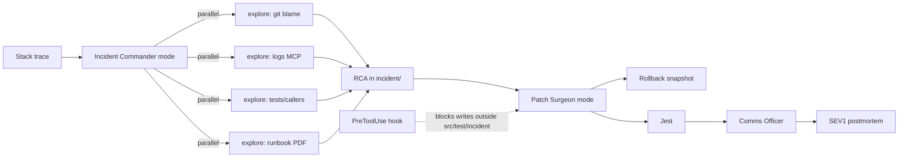

# IBM Bob 2.0 — Five Winning Product Concepts

**Thesis:** Last year the best native submissions *generated* Bob config (SkillForge, Doc2Skills) or added a *single* verifier persona (Verdict). This year the product **is** a drop-in `.bob/` pack: custom modes with tool walls, skills as playbooks, a tiny MCP as deterministic hands, parallel subagents as the org chart, hooks as policy, rollback as the safety net. Clone the sample repo → Bob *becomes* the team. No Streamlit. No chatbot wrapper.

**Coin tactic (40 Bobcoins):** Hand-write `.bob/` (or generate it here, not in Bob). Spend coins only on 2–3 end-to-end demo rehearsals. Prefer `explore` subagents (lighter model). Keep the sample app tiny and fixture-driven so MCP never flakes on stage.

**Shared sample (optional):** one toy repo, **Northstar Pay** — a small Express + Jest payments API with planted bugs, a runbook PDF, an OpenAPI spec, CI JSON fixtures, and a “ready-to-ship” branch that is not actually ready. Each idea below can also stand on its own sample.

---

## Rank 1 — WARPATH

**One-liner:** Paste a stack trace; Bob stands up an incident war room, fans out forensics, patches under rollback, and files the postmortem.

**Workflow:** Debugging (on-call / MTTR)

**Problem:** A Sev-1 burns 30–90 minutes of a senior engineer correlating logs, git blame, runbooks, and tests while Slack is on fire. AI chatbots that “explain the stack trace” do not close the incident.

### Architecture

```
.bob/
  custom_modes.yaml
  skills/warpath-intake/
  skills/warpath-forensics/
  skills/warpath-patch/
  skills/warpath-postmortem/
  rules/incident-protocol.md
  rules-incident-commander/
  mcp.json                    # warpath-signals (local STDIO)
  settings.json               # hooks
  hooks/inject-git-sha.sh
  hooks/block-out-of-scope-writes.sh
```

| Piece | Role |
|---|---|
| **Mode `incident-commander`** | Orchestrator. Tools: `read`, `skill`, `subagent`, `todo`, `mcp`, `mode`. Edit locked to `incident/**/*.md` via `fileRegex`. Cannot touch `src/`. |
| **Mode `forensic-explorer`** | Read-only. `allowedSubagents: [explore]`. No execute that mutates. |
| **Mode `patch-surgeon`** | `edit` + `execute` but `fileRegex` = `src/.*` + `test/.*`. Skills: patch + tests. |
| **Mode `comms-officer`** | Markdown only (`incident/.*`, `CHANGELOG.md`). |
| **Skill intake** | Parse stack/alert → spawn the four forensics in parallel → RCA template. |
| **Skill forensics** | How to blame frames, correlate logs, read runbook PDFs, find missing tests. |
| **Skill patch** | Minimal fix, regression test, stop if tests fail → recommend rollback. |
| **Skill postmortem** | SEV1 template, timeline, blast radius, follow-ups. |
| **MCP `warpath-signals`** | Deterministic demo tools: `get_stack_trace`, `get_logs(window)`, `get_metrics`, `get_recent_deploys`. Fixtures on disk (not live prod). Same interface later maps to real backends. |
| **Subagents (parallel money shot)** | (1) git blame + commits touching stack frames, (2) log window around timestamp, (3) callers/callees + existing tests, (4) runbook PDF via document understanding. |
| **Hooks** | `SessionStart` injects branch, SHA, last tag. `PreToolUse` blocks writes outside allowed paths (second wall beyond `fileRegex`). `Stop` writes `incident/metrics.json` (elapsed seconds). |
| **Rollback** | Snapshot before patch-surgeon touches code. Demo the undo if the first fix is wrong. |
| **Optional watsonx** | Granite classifies severity; Orchestrate pages a human. Not required for the win. |

### 90-second demo

1. **0:00** Terminal is red. `GET /webhooks/stripe` 500s. Show the planted stack trace.
2. **0:08** Switch mode → **Incident Commander**. Prompt: *Stand up the war room for this Sev-1.*
3. **0:18** **Parallel subagents panel** fills (the screenshot that wins). Four explorers run.
4. **0:50** Commander reads summaries: null `userId` in webhook handler, introduced in `feat: async billing` yesterday; runbook says “retry on 409” but we throw 500; no test for missing customer.
5. **1:02** Switch **Patch Surgeon**. Fix + regression test. Point at **rollback** snapshot.
6. **1:18** Tests green. **Comms Officer** writes `incident/SEV1-2026-02-14.md`.
7. **1:28** Overlay: *MTTR 47 min → 82 sec. RCA + patch + postmortem in one task.*

### Sample project

Northstar Pay with: (a) webhook handler that 500s on missing `customer.id`, (b) `fixtures/logs.json` + `fixtures/deploy.json`, (c) `docs/runbook-payments.pdf` (one-pager PDF), (d) a recent “innocent” commit that actually caused it.

### Measurable impact

- Time-to-RCA, time-to-green, pages written vs. Slack archaeology.
- Demo number: **~40–60 min → < 2 min** on the planted incident.
- Hook-emitted `incident/metrics.json` is the proof artifact.

### Why this is not last year

SkillForge *emitted* skills. Doc2Skills *converted* PDFs into skills. Verdict *verified* a diff. Warpath **is a live multi-agent incident org** whose org chart is custom modes, whose hands are MCP fixtures, whose walls are hooks, and whose undo is rollback. The runbook PDF is *consumed at incident time*, not compiled into a skill once.

### 48h / 40-coin cut

Hand-author 4 skills + 4 modes + a 80-line Node MCP that reads `fixtures/`. Do **not** connect real Datadog. One Bob rehearsal is the whole show. If time dies, drop comms-officer and generate the postmortem in commander (markdown-only edit is enough).

---

## Rank 2 — TRIBUNAL

**One-liner:** A PR is tried by four tool-walled judges in parallel; a clerk writes the verdict; a surgeon may fix only what the court allowed — and hooks refuse anything else.

**Workflow:** Code review

**Problem:** One “please review this” LLM pass is a vibe. Real review is specialized (security ≠ a11y ≠ tests ≠ docs), and AI that can both judge *and* rewrite will rubber-stamp its own code. Last year’s Verdict was one verifier mode. That’s the gap.

### Architecture

```
.bob/
  custom_modes.yaml          # 6 personas
  skills/tribunal-docket/
  skills/judge-security/
  skills/judge-correctness/
  skills/judge-tests/
  skills/judge-docs/
  skills/clerk-verdict/
  skills/surgeon-fix/
  rules-security-judge/
  mcp.json                   # git-diff + SARIF writer
  settings.json              # PreToolUse walls
```

| Mode | Tools | fileRegex / walls |
|---|---|---|
| **chief-justice** | read, skill, subagent, todo, mcp, mode | no src edits |
| **security-judge** | read, skill, mcp | **no edit, no execute** |
| **correctness-judge** | read, skill | no edit |
| **test-judge** | read, skill | no edit |
| **docs-judge** | read, skill | no edit |
| **surgeon** | edit, execute, skill | `src/.*` + `test/.*` only |
| **clerk** | edit | `reviews/.*\.md$` + `*.sarif` only |

**Parallel subagents:** four judges at once on the same diff (security, correctness, tests, docs). Isolated contexts so the security finding cannot contaminate the docs judge.

**MCP:** `get_diff(base)`, `write_sarif(findings)`, `list_secrets_patterns`. Local.

**Hooks:** `PreToolUse` on write — judges cannot write; surgeon cannot write `reviews/`; clerk cannot write `src/`. Triple-redundant with mode `groups`.

**Rollback:** surgeon’s first pass is always reversible. If tests go red, roll back and re-docket.

**Built-in `/review` + commit messages + PR:** after the court, generate the PR description from `reviews/VERDICT.md` so Bob’s native PR feature is part of the product, not a sidebar.

### 90-second demo

1. Show a branch with: SQL-string concat, no test for the new endpoint, README that claims rate-limiting (code doesn’t).
2. Mode **Chief Justice**: *Call the tribunal on `main...HEAD`.*
3. Four judges spawn — **parallel panel**.
4. Clerk produces `reviews/VERDICT.md` with severities. One **Critical** (injection).
5. Attempt (or hook-block) a surgeon edit to README — **blocked**. Then allowed fix to the query + a test.
6. `/review` + “create PR”. Overlay: *4 specialist reviews in 55s; 1 critical caught that Copilot-style single review missed in the dry-run.*

### Sample project

Same Northstar Pay, branch `feat/export-csv` with three planted defects of different classes (so each judge has something to say).

### Measurable impact

- Defects caught pre-human-review (planted-bug catch rate 3/3).
- Reviewer minutes saved; time-to-first-serious-comment.
- SARIF artifact for the submission repo.

### Why this is not last year

Verdict = one verifier. Tribunal = **separation of powers implemented as tool constraints**. Judges literally cannot patch. The surgeon cannot close the docket. That is a product you *install*, not a prompt you *hope*.

### 48h cut

Two judges (security + tests) still win the demo if four is too much. Clerk + surgeon + one blocking hook are non-negotiable — they are the punchline.

---

## Rank 3 — LAUNCHCODES

**One-liner:** Switch to Release Captain — a mode that **cannot write application code** — and Bob runs parallel go/no-go gates until it will (or will not) cut the release.

**Workflow:** Release and deployment

**Problem:** “Are we ready?” is a 2-hour scavenger hunt across changelog, CVEs, migrations, coverage, runbooks, and “did anyone update the feature flag default.” Dashboards exist; they do not *live in the repo with the people shipping*.

### Architecture

| Piece | Role |
|---|---|
| **Mode `release-captain`** | Tools: read, skill, subagent, mcp, todo. Edit **only** `release/**`. No `execute` that deploys. The product *is the refusal to code.* |
| **Mode `release-scribe`** | `CHANGELOG.md`, `release/notes.md`, PR body. |
| **Skills** | `gate-changelog`, `gate-cve`, `gate-migrations`, `gate-tests`, `gate-runbook`, `gate-rollback-plan` |
| **MCP** | `npm_audit_fixture`, `coverage_delta`, `migration_list`, `git_log_since_tag` |
| **Parallel subagents** | five gates at once: CVE, changelog completeness, schema migrations, coverage delta, runbook/PDF completeness (document understanding of `docs/ops.pdf`). |
| **Hooks** | `UserPromptSubmit` — if prompt contains `npm publish` / `kubectl apply` and any gate is red, **exit 2**. `SessionStart` injects latest tag + dirty file count. |
| **Native PRs** | Green gates → Bob opens the release PR with notes. Red gates → `release/NO-GO.md` with owners. |

### 90-second demo

1. Tag `v1.1.0-rc`. Branch looks shippable.
2. **Release Captain:** *Go/no-go for 1.1.0.*
3. Parallel gates: changelog OK; **CVE in `jsonwebtoken@8`**; migration `004` has no down; coverage −6% on `auth/`; runbook PDF still says “sessions in memory.”
4. Captain writes `release/NO-GO.md`. Try “just publish it” → **hook blocks the prompt**.
5. Flip to a cleaned branch (or apply the three fixes live if coins allow) → **GO**, generate notes + PR.

### Sample project

Northstar Pay `release/1.1.0` with one real public CVE in package.json, one migration without rollback, stale ops PDF.

### Measurable impact

- Time to a documented go/no-go (hours → minutes).
- Escaped release defects (CVE + missing down-migration caught).
- Artifact: `release/NO-GO.md` vs `release/GO.md` in the repo.

### Why this is not last year

Not a release *chatbot*. Not Praxis (multi-model config). The innovation is a **first-class mode whose power is what it is forbidden to do**, plus blocking hooks as the last line, plus parallel gates as the org. IBM-enterprise judges will feel this in their bones.

### 48h cut

Three gates (CVE, changelog, tests) + blocking hook + NO-GO.md is enough. Skip real npm registry; fixture the audit JSON.

---

## Rank 4 — ANNEX

**One-liner:** Modernize a legacy module inside a sandboxed `/annex` directory — hooks are the walls, explore subagents are the archaeologists, rollback is the escape hatch.

**Workflow:** Application maintenance / legacy modernization

**Problem:** “Rewrite auth” in a living app becomes a drive-by rewrite of 40 files. AI agents are the worst offenders. Teams need strangler-fig **enforced by the tool**, not by a sticky note.

### Architecture

| Piece | Role |
|---|---|
| **Mode `archaeologist`** | read + skill + explore subagents only. |
| **Mode `cartographer`** | edit `docs/architecture.md` and `docs/*.mmd` only. |
| **Mode `annex-surgeon`** | edit `annex/**` + tests for annex **only**. `fileRegex: ^(annex/\|test/annex/).*` |
| **Mode `cutover-captain`** | may edit one adapter file `src/legacy/bridge.js` after gates pass. |
| **Skills** | `excavate`, `draw-strangler`, `port-module`, `dual-run-test`, `cutover` |
| **MCP** | `legacy_routes`, `db_schema_fixture` (from a dumped `schema.sql`, not a live DB) |
| **Document understanding** | old `docs/auth-spec-2009.pdf` + current code; conflict list. |
| **Parallel subagents** | (1) call graph of `auth/`, (2) env/config coupling, (3) tests that pin old behavior, (4) PDF spec vs code drift. |
| **Hooks** | `PreToolUse` **exit 2** if write path is not under `annex/` unless mode is cutover-captain and `release/ANNEX-GREEN` exists. |
| **Rollback** | after each ported function. Demo a bad port → restore → second approach. |
| **Literate coding** | in `annex/` files, comments are the port spec (`// STRANGLER: preserve 409 on duplicate email`). |

### 90-second demo

1. Open messy Express 16-era `src/auth` (use IBM’s own Node 16→22 tutorial app as the sample).
2. **Archaeologist:** *Excavate auth for strangler.* Four explorers + PDF spec.
3. Cartographer drops a mermaid “old vs annex.”
4. **Annex Surgeon** ports `register()` into `annex/auth`. Show a forbidden edit to `src/auth/legacy.js` — **blocked by hook**.
5. Dual-run test passes. Rollback control shown. Overlay: *zero files outside annex touched.*

### Sample project

IBM Bob tutorial “Modernize a Node.js application (v16 → v22)” plus a one-page PDF “original auth rules.” Fastest path to a real-looking legacy.

### Measurable impact

- Files touched outside strangler boundary: **0** (hook-enforced).
- Time to first dual-run test for one module.
- Risk: blast radius of modernization, made visible.

### Why this is not last year

Not “AI rewrites the app.” Not Doc2Skills (the PDF is evidence during excavation). The product is **capability-based modernization**: the agent physically cannot roam. Rollback + literate comments + parallel archaeology is Bob 2.0-only.

### 48h cut

One function (`register` or `login`), one hook, one mermaid, one dual-run test. Do not try to finish the whole auth rewrite.

---

## Rank 5 — HARNESS

**One-liner:** Bob becomes the test org — coverage hunter, flake prosecutor, contract tester, and a surgeon who is only allowed to touch test files.

**Workflow:** Testing

**Problem:** Coverage is 41%, three tests are flaky, the OpenAPI spec drifted from handlers, and the people who would fix it are writing features. Generic “write tests” prompts dump low-value tests into production files.

### Architecture

| Mode | Wall |
|---|---|
| **qa-captain** | orchestrate only |
| **coverage-hunter** | explore subagents, read lcov via MCP |
| **flake-prosecutor** | reads `fixtures/jest-results.json` (N runs) |
| **contract-tester** | OpenAPI vs routes |
| **test-surgeon** | `fileRegex: .*\.(test\|spec)\.(js\|ts)$` — **cannot edit src** |

**Skills:** `raid-coverage`, `prosecute-flakes`, `pact-from-openapi`, `author-characterization-tests`

**MCP:** `coverage_gaps`, `flake_report`, `openapi_diff`

**Parallel:** coverage gaps ∥ flake clustering ∥ unimplemented spec paths ∥ existing test smells.

**Hooks:** block test-surgeon writes to `src/`. `Stop` writes `qa/scorecard.md` (coverage %, flake count, contract misses).

**Literate coding:** characterization tests generated from comments in the test file.

### 90-second demo

1. Show Jest: 41% coverage, `auth.test.js` failed 4/10 in the fixture, `/refunds` in OpenAPI has no handler test.
2. **QA Captain:** *Raid the suite.*
3. Parallel panel. Scorecard appears.
4. Test-surgeon adds a characterization test + a contract test. Attempt to “just fix the code” → **blocked**.
5. Coverage 41% → 63% on the hot paths; flake quarantined with `it.skip` + ticket comment. Overlay the scorecard.

### Sample project

Northstar Pay tests + `openapi.yaml` + `fixtures/jest-10-runs.json` (checked-in, deterministic).

### Measurable impact

- Coverage delta on changed lines, flake quarantine count, contract gaps closed.
- Time to a written QA scorecard.

### Why this is not last year

Not “generate unit tests.” The product is **an org with a surgeon who cannot touch production code**, parallel hunters, and a scorecard hook. Characterization-first avoids the “AI tests the AI’s fantasy API” failure mode.

### 48h cut

Skip flake clustering if needed. Coverage raid + fileRegex wall + scorecard still demos cleanly.

---

## Ranking rationale

| Rank | Idea | Crowd wow | IBM-enterprise | Bob 2.0 depth | 48h safety | Clone risk |
|---|---|---|---|---|---|---|
| 1 | **WARPATH** | ★★★★★ parallel panel + red terminal | High (MTTR) | skills+modes+MCP+hooks+rollback+docs | High if fixtures | Low |
| 2 | **TRIBUNAL** | ★★★★ judges | Very high | tool walls as the product; beats Verdict | High | Medium (review is popular) — offset by walls |
| 3 | **LAUNCHCODES** | ★★★ hook-blocks publish | ★★★★★ | refusal-as-feature | High | Low-medium |
| 4 | **ANNEX** | ★★★ blocked write | High (legacy) | hooks as walls + PDF archaeology | Medium (legacy is sticky) | Medium (appendix #5) |
| 5 | **HARNESS** | ★★★ | High | test-only surgeon | High | Medium (appendix #3) |

**Pick WARPATH** if you want the cinematic 90s and a screenshot of the parallel subagents panel that no last-year project could produce.

**Pick TRIBUNAL** if you expect judges who saw Verdict and will reward the sequel that actually encodes separation of powers.

**Pick LAUNCHCODES** if the room is IBM-heavy and you want “this could ship on a regulated team Monday.”

Avoid building a generic onboarding bot (appendix #1) or a Streamlit dashboard. Both will be common and both fail “Bob is the core.”

---

## What “installable” means for submission

The repo *is* the product:

```
northstar-pay/
  src/ ...
  fixtures/ ...
  docs/*.pdf
  .bob/
    custom_modes.yaml
    mcp.json
    settings.json          # hooks
    skills/*/SKILL.md
    rules/
    rules-*/               # per-mode
    hooks/*.sh
  bob_sessions/*.png       # required
  DEMO.md                  # 90-second script, timed
```

Judge clones (or you open) the repo in Bob IDE → modes appear → one prompt runs the workflow. That is the entire product surface.

---

## Anti-patterns (do not do these)

1. **SkillForge 2.0** — generating skills from a repo. That already won. Use skills as the *runtime*.
2. **Doc2Skills 2.0** — PDF in, SKILL.md out. Consume documents *during* the workflow instead.
3. **Praxis 2.0** — a config UI for many models. Stay inside Bob.
4. **Verdict 2.0** — a single reviewer persona with no tool walls.
5. **Streamlit / Gradio / “chat with your repo” web apps** — ineligible energy even if Bob helped write them.
6. **Live production APIs in the demo** — they will fail on stage. Fixture MCP.
7. **Spending Bobcoins to author YAML** — that’s what this workspace is for.

---

## Recommended 48-hour plan (if you pick WARPATH)

| Hours | Work | Coins |
|---|---|---|
| 0–3 | Plant the incident in Northstar Pay + PDF runbook + log fixtures | 0 |
| 3–8 | `custom_modes.yaml`, 4 SKILL.md, rules, hook scripts | 0 |
| 8–12 | MCP `warpath-signals` (Node, STDIO, 4 tools) + `.bob/mcp.json` | 0 |
| 12–16 | Dry-run the MCP from CLI; write DEMO.md timed | 0 |
| 16–22 | **First Bob rehearsal** (the expensive one). Tighten skill text. | ~12–15 |
| 22–28 | Fix walls (fileRegex + hook). Add postmortem template. | ~5 |
| 28–34 | **Dress rehearsal** timed to 90s. Capture `bob_sessions` PNGs. | ~10–12 |
| 34–40 | README, before/after metrics, architecture mermaid, backup GIF of parallel panel | 0 |
| 40–48 | Buffer. If broken, collapse to 3 subagents + 2 modes. Still wins. | reserve |

---

## One-slide architecture (WARPATH)


